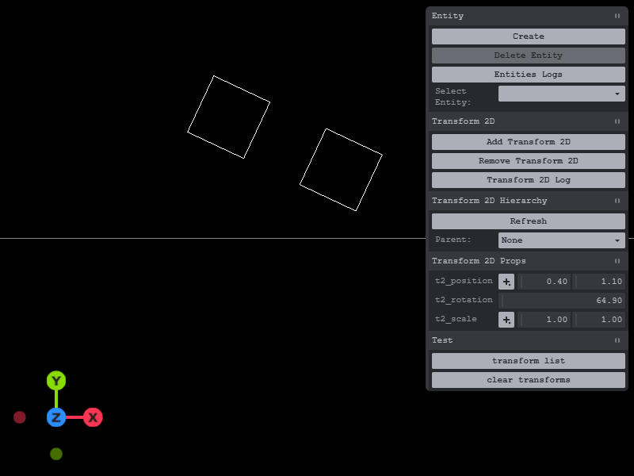

# spacetimedb-app-transform2d

# License: MIT

# SpaceTimeDB
 - 2.1.0

# Transform 2D Hierarchy:
  This is transform 2D hierarchy to test parent and child matrix for position, rotation and scale. With the help of Grok A.I agent. To able to use three js matrix and helper to handle transform 2D hierarchy. Note this use matrix3 not matrix4.
  
  It was tricky to setup 2d world with three javascript build. Since it 3D is convert to 2D that use x and y.

- [ ] Schedule Tables
- [x] reducer (function for client to access)
- [ ] trigger event

# Notes:
  This is just the basic how transform 2D hierarchy. For handle the current view that player see required some filter from range base which matrix can't use but convert x and y format. There should be in docs about it.

  Made into module files for easy later for other project place for ease of use.

```ts
export const transform2d = table(
  { 
    name: 'transform2d', 
    public: true,
  },
  {
    entityId: t.string().primaryKey(),
    parentId: t.string().optional(),
    isDirty:t.bool().default(true),
    position: Vect2,
    rotation: t.f32(), // degree
    scale: Vect2,
    localMatrix: t.array(t.f32()).optional(),
    worldMatrix: t.array(t.f32()).optional(),
    // g_x:t.f64(),
    // g_y:t.f64(),
    // or 
    //x:t.f64(),
    //y:t.f64(),
  }
);
```
  It depend how it setup to handle update and filter.

## refs:
- https://spacetimedb.com/docs/databases/transactions-atomicity
- https://spacetimedb.com/docs/functions/views




# Editor:
  Current testing the position, rotation for degree, scale to update for transform 2d with sqaure place holder default 1:1 scale. Using the Tweakpane to debug sync from the SpaceTimeDB.

## Features:

### Client features:
- [x] create entity
- [x] delete entity and check for transform 2d to delete match entity id.
- [x] add transform 2d
- [x] remove transform 2d
- [x] select transform 2d
  - [x] set local position
  - [x] set local rotation
  - [x] set local scale
  - [x] set parent id
- [x] select entity if there transform 2d added that will display yellow marker.
  - [x] using the reducer to update all transforms base on isDirty propagation.
- [ ] demo three js transform 3d hierarchy stand alone test.

### Server features:
- [x] transform 2D hierarchy
  - [x] still need to test more
  - [x] reducer
    - [x] update transform2d if isDirty to propagation.
      - [x] update the local and world matrix for parent and child matches.
    - [x] set transform2d position, rotation and scale to local matrix
    - [x] set position
    - [x] set rotation
    - [x] set scale
    - [x] set parent id
  - [ ] schedule
  - [ ] Procedures:
    - [x] get parent id
    - [x] get position from local or world matrix
    - [x] get rotation from local or world matrix
    - [x] get scale from local or world matrix
    - [x] get transform2d position, rotation and scale from local or world matrix


# Config:
  Make sure the application database name match the server and client. Since using the ***spacetime dev*** command line to run development mode to watch and build.

## Client
```js
const DB_NAME = 'spacetime-app-transform2d';
```
## Server:
spacetime.json
```json
//...
"database": "spacetime-app-transform2d",
//...
```
spacetime.local.json
```json
//...
"database": "spacetime-app-transform2d",
//...
```

# Commands:
```
bun install
```
```
spacetime start
```
```
spacetime dev --server local
```
# SQL:
```
spacetime sql --server local spacetime-app-transform2d "SELECT * FROM entity"

spacetime sql --server local spacetime-app-transform2d "SELECT * FROM transform3d"

```
 For query table in command line.

# SQL to text file:

```
spacetime sql --server local spacetime-app-transform2d "SELECT * FROM transform2d" > backup_your_table.txt
```
 Test

# Delete
```
spacetime publish --server local spacetime-app-transform2d --delete-data
```
 In case bug and can't update table error.

# Credits:
- https://spacetimedb.com/docs
- Grok AI agent

# Server:
 - Note due to reducer have limited child to one to query. If more child to sub child it will not update the table. As it did say in docs.
 
## Tables:
```ts
export const entity = table(
  { 
    name: 'entity', 
    public: true,
  },
  {
    id: t.string().primaryKey(),
  }
);

export const transform2d = table(
  { 
    name: 'transform2d', 
    public: true,
  },
  {
    entityId: t.string().primaryKey(),
    parentId: t.string().optional(),
    isDirty:t.bool().default(true),
    position: Vect2,
    rotation: t.f32(), // degree
    scale: Vect2,
    localMatrix: t.array(t.f32()).optional(),
    worldMatrix: t.array(t.f32()).optional(),
  }
);
```

# Client api:
  Sample test that use threejs build in 2d to 3d translate flat 2d world.

## setup:

### setupDBEntity
```js
function onInsert_Entity(_ctx, row){
  console.log(row);
  PARAMS.entities.push(row);
  update_entities_list();
}

function onDelete_Entity(_ctx, row){
  PARAMS.entities=PARAMS.entities.filter(r=>r.id!=row.id)
  update_entities_list();
}

function setupDBEntity(){
  conn.subscriptionBuilder()
    .subscribe(tables.entity)
  conn.db.entity.onInsert(onInsert_Entity)
  conn.db.entity.onDelete(onDelete_Entity)
}
```
### setupDBTransform2D:

```js
function transformPoint(m, x, y) {
  return {
    x: m[0]*x + m[1]*y + m[2],
    y: m[3]*x + m[4]*y + m[5]
  };
}
function getScaleFromMatrix(m) {
  const scaleX = Math.hypot(m[0], m[3]);   // length of transformed X axis
  const scaleY = Math.hypot(m[1], m[4]);   // length of transformed Y axis
  return { x: scaleX, y: scaleY };
}
function extractWorldRotation(worldMatrix){
  // Use the first column (or second) - more stable than atan2 on b
  const a = worldMatrix[0];  // m00
  const c = worldMatrix[3];  // m10   (this is sin part in your convention)
  const angleRad = Math.atan2(c, a);        // This gives correct angle even with scale
  let angleDeg = angleRad * (180 / Math.PI);
  // Normalize to 0-360 or -180 to 180 if you prefer
  if (angleDeg < 0) angleDeg += 360;
  return angleDeg;
}
```

```js
function create_2d(){
  let size = 1
  const geometry = new THREE.PlaneGeometry(size, size);
  const edges = new THREE.EdgesGeometry(geometry);
  const lineMaterial = new THREE.LineBasicMaterial({ color: 0xffffff });
  const mesh = new THREE.LineSegments(edges, lineMaterial);
  // mesh.matrixAutoUpdate = false; // disable to use matrix
  return mesh;
}
```

```js
function update_model2d(mesh, row){
  const worldPos = transformPoint(row.worldMatrix, 0, 0);
  let worldScale = getScaleFromMatrix(row.worldMatrix);
  mesh.position.set(worldPos.x, worldPos.y, 0);
  const worldRot = extractWorldRotation(row.worldMatrix)
  mesh.rotation.z = worldRot * (Math.PI / 180); 
  mesh.scale.set(worldScale.x, worldScale.y, 1);
}
```

```js
function onInsert_Transfrom2D(_ctx, row){
  // console.log("transform");
  // console.log(row);
  PARAMS.transform2d.push(row);
  //insert_model2d(row);
}
```
```js
function onUpdate_Transfrom2D(_ctx, oldRow, newRow){
  // console.log("transform");
  // console.log(row);
  PARAMS.transform2d = PARAMS.transform2d.filter(r=>r.entityId != newRow.entityId);
  PARAMS.transform2d.push(newRow);
  const cmesh = scene.children.find(r=>r.userData?.row?.entityId == newRow.entityId);
  if(cmesh){
    if(newRow.worldMatrix){
      // console.log(newRow.worldMatrix)
      // update_model2d(cmesh, newRow);
    }
  }
}
```
```js
function delete_model2D(ctx, row){
  for(const mesh of scene.children){
    if(mesh.userData?.row?.entityId == row.entityId){
      scene.remove(mesh);
      break;
    }
  }
  PARAMS.transform2d=PARAMS.transform2d.filter(r=>r.entityId!=row.entityId)
}
```
```js
function setupDBTransform2D(){
  conn.subscriptionBuilder()
    .subscribe(tables.transform2d)
  conn.db.transform2d.onInsert(onInsert_Transfrom2D)
  conn.db.transform2d.onUpdate(onUpdate_Transfrom2D)
  conn.db.transform2d.onDelete(delete_model2D)
}
```

## Entity
  Having id tag string for handle. For easy to add on to type of components.
### createEntity:
```js
  conn.reducers.createEntity({})
```
  Create blank entity.
### deleteEntity:
```js
  conn.reducers.deleteEntity({
    entiyId:PARAMS.entityId
  });
```
  Delete Entity base on entityId. Check for any components to be delete as well.

## Transform 2D:
 There are get and set function for transform 2D. Can get and set for parent, transform2d (all input and output but not parent id), position, rotation and scale. As well other debug call functions.
 
### setTransform2DParent:
```js
  conn.reducers.setTransform2DParent({
    entityId:PARAMS.entityId,
    parentId:id // parentId
  })
```

### setTransform2D:
```js
conn.reducers.setTransform2D({
    entityId:PARAMS.entityId, 
    position:PARAMS.t2_position, // {x=0,y=0,z=0}
    rotation:PARAMS.t2_rotation, 
    scale:PARAMS.t2_scale, // {x=1,y=1,z=1}
  });
```

### setTransform2DPosition:
```js
  conn.reducers.setTransform2DPosition({
    entityId:PARAMS.entityId,
    x:PARAMS.t2_position.x,
    y:PARAMS.t2_position.y
  });
```

### setTransform2DRotation:
```js
  conn.reducers.setTransform2DRotation({
    entityId:PARAMS.entityId,
    rotation: PARAMS.t2_rotation // degree
  });
```

### setTransform2DScale:
```js
  conn.reducers.setTransform2DScale({
    entityId:PARAMS.entityId,
    x:PARAMS.t2_scale.x,
    y:PARAMS.t2_scale.y
  })
```

### getTransform2DParentId:
```js
  let _parentId = await conn.procedures.getTransform2DParentId({
    entityId:PARAMS.entityId
  });
  console.log("Parent Id:", _parentId)
```
### getLocalTransform2D:
```js
  let t2d = await conn.procedures.getLocalTransform2D({
    entityId:PARAMS.entityId
  });
  console.log("getLocalTransform2D:", t2d);
  // {position:{x:1,y:1,z:0},rotation:0,scale:{x:1,y:1,z:1}}
```

### getLocalPosition2D:
```js
  let pos = await conn.procedures.getLocalPosition2D({
    entityId:PARAMS.entityId
  });
  console.log("pos:", pos)
```

### getLocalRotation2D:
```js
  let rot = await conn.procedures.getLocalRotation2D({
    entityId:PARAMS.entityId
  });
  console.log("rot:", rot)
```

### getLocalScale2D:
```js
  let scale = await conn.procedures.getLocalScale2D({
    entityId:PARAMS.entityId
  });
  console.log("scale:", scale)
```

### getWorldTransform2D:
```js
  let t2d = await conn.procedures.getWorldTransform2D({
    entityId:PARAMS.entityId
  });
  console.log("getWorldTransform2D:", t2d);
  // {position:{x:1,y:1,z:0},rotation:0,scale:{x:1,y:1,z:1}}
```

### getWorldPosition2D:
```js
  let pos = await conn.procedures.getWorldPosition2D({
    entityId:PARAMS.entityId
  });
  console.log("pos:", pos)
```

### getWorldRotation2D:
```js
  let rot = await conn.procedures.getWorldRotation2D({
    entityId:PARAMS.entityId
  });
  console.log("rot:", rot)
```

### getWorldScale2D:
```js
  let scale = await conn.procedures.getWorldScale2D({
    entityId:PARAMS.entityId
  });
  console.log("scale:", scale)
```

### clearAllTransforms:
```js
  conn.reducers.clearAllTransforms();
```
  For debugging.